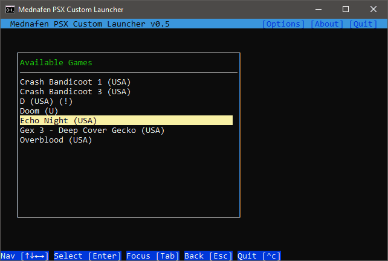

# PSX Launcher for Mednafen

**PSXMED version** : 0.5 (*2020-10*), **License** : MIT   
**Author** : John Dimi  

This is a very simple CLI **PS1** game **launcher** for **Mednafen** that comes with some **practical features.**

- Deep scan a directory and present valid CD game files on a list
- Option to operate on an **alternative save folder** for all saves/savestates. Then copy these files over to the mednafen save folder from within the interface.
- Option to **automatically mount** `.ZIP` archives using the **Pismo File Mount** program and then run those games automatically
- Exposes some Mednafen graphic options, so you don't have to *tweak* the `.cfg` files manually

## Installing and Requirements

- This app is **WINDOWS ONLY** (I'm sure it can be ported to linux easily, since is made with HAXE, but I can't bother)
- Requires : **nodeJS** with **npm** installed on your system. [Get the LTS](https://nodejs.org)
- **Mednafen** - https://mednafen.github.io
- **Pismo File Mount Audit Package**  - :exclamation: *optional*
  - Get from here: http://pismotec.com/download
  - This allows mounting `.ZIP` archives into virtual folders (*along with pismo extensions `.pfo .cfs`*) 
  - :question: *Are there any other programs that can do this? PM me*

### To Install
You can install this with **NPM** , and be able to launch this from anywhere. *This is recommended*  
**`npm i https://github.com/johndimi/psxlauncher -g`**  

### Running
- Just call **`psxmed`** from anywhere.  
  **I recommend** calling it from a Windows RUN dialog, so that it opens in a new window (*`WIN + R` -> psxmed*) 
- **At first run** you must  setup the config file.  
  To quickly open `config.ini` you can run `psxmed cfg` and the file will be opened with the default editor. Else when you run `psxmed` it will inform you that it needs to be configured along with the full path of the config file. 
- Supported **File Extensions** are `.cue` and `.m3u`. If you have `pismo file mount` installed and enabled, it also supports `.pfo` `.cfs` and `.zip`

### Important notice about Current Savegames :warning:

PSX Launcher **alters** the naming template for savegames. It will read and write the `psx.cfg` file and make the changes upon application start. 

The default Mednafen save name convention for saves and states is like this : `GAME NAME.MD5.EXT` e.g.  
`Gex 3 - Deep Cover Gecko (USA).6b7f1763881380d97c7124f848c0712d.0.mcr`

But PsxLauncher needs the filesaves to be like this : `GAME NAME.EXT` e.g.  
`Gex 3 - Deep Cover Gecko (USA).0.mcr`  (Basically the same name without the MD5)  

**If you want to make the files work, just rename them manually for now**, delete the MD5 portion.  
Look into `mednafen/mcs` and `mednafen/sav` for saves. 

Sorry.:man_shrugging:

### Pismo Mountable Archives :point_left:

Make sure the mountable filename is the same as the `.cue` or `.m3u` that needs to be loaded inside the archive.

> e.g. The file `"Game - Subtitle (PAL).zip"` must contain `"Game - Subtitle (PAL).cue"`  
> or `"Game - Subtitle (PAL).m3u"` , to be able to work

## Building :wrench:

- Some general HAXE knowledge is required
- **Haxe 4.1.3** https://haxe.org
- **djNode V0.6.0** https://github.com/johndimi/djNode -- Get the tag zip and install it with haxelib
- **djTui V0.2.0** https://github.com/johndimi/djTui -- Get the tag zip and install it with haxelib
- **hxnodejs** `haxelib install hxnodejs`

Then **use NPM** to build: `npm run build` 

## About the Project

This app was created for personal use. But decided to upload to github anyway. I wanted a simple and quick way to launch Mednafen games, and automate a bunch of actions I was doing by hand. I used tools that I was already comfortable with. Also it was a nice programming practice and application of my `djTui` library

**Why have saves on a Alternative Folder and then copy to from mednafen ?**  

1. Writing savestates all the time can be taxing to an SSD drive. You can set the savedir to be on a ramdrive
2. Loading a savestate will also overwrite all .MCR files (memory card). This could accidentally lead to save data loss. Also more re-writes on the SSD drive for no reason.
3. It is faster to write the savestate on a ramdrive (possibly)

**Why/How mount ZIP files**  
The program `Pismo File Mount` can mount zip files into a virtual folder and then you can load games from there. The launcher can automatically orchestrate the process of mounting/unmounting games as you launch them. Having games in zip format saves space.

**Why nodejs? and CLI?**  
I like nodejs, it's simple, fast, and it does the job. Also it snowballed from something extremely simple just to launching games to having a UI and changing mednafen settings etc.

Thanks for checking this out :smile_cat:,  
John.