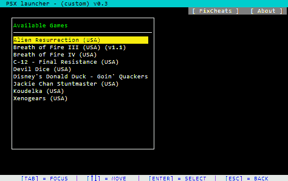

PSX Launcher for Mednafen (PSXMED)
 --------------------- 
**Author** :  John Dimi <johndimi@outlook.com>\
**Version** : 0.4 (3-2019)\
**Code**: Haxe compiled to nodejs

##  :question: What is it

This is a very simple **CLI** PS1 game launcher for **Mednafen** that comes with some practical features.

- Deep scan a directory and present valid **cd games** on a list
- Option to **copy over saves** from mednafen path to a **ramdrive** ( and vice versa )
- Option to **automatically mount** `.ZIP` archives using the **Psimo File Mount** program and then run those games automatically
- Provide a fix for mednafen's cheat file not properly being saved.
 
:pushpin: This project was created for personal use. But decided to upload to github anyway \
As to WHY have these niche features and not a classic launcher, read further below. :pushpin:

## :beginner: Requirements

- This is for **Windows** only (*tho it can probably be ported to linux easily, I can't bother*)
- **nodeJs**  installed on your system. [GET](https://nodejs.org)
-  **Pismo File Mount Audit Package** 
	- :exclamation: *optional*
	- Get from here: http://pismotec.com/download/
	- This allows mounting `.ZIP` archives into virtual folders
	- Are there any other programs that can do this? PM me
- **Ramdrive program**
	- :exclamation: *optional*
	- You can use anything you like
	- Checkout https://sourceforge.net/projects/imdisk-toolkit/
- **Mednafen**
	- https://mednafen.github.io/
	- *I think it's the best PS1 emulator*

## :runner: Setting up / Running

### Installing
You can install this with **NPM** to be able to launch this from anywhere. *This is recommended*\
**`npm i https://github.com/johndimi/psxlauncher -g`**

### Running
Just call **`psxmed`** from anywhere.\
**I recommend** calling it from a Windows RUN dialog, so that it opens in a new window\
Then you must **setup the config file**. \
To quickly open `config.ini` you can run `psxmed cfg` and the file will be opened with the default editor. Else when you run `psxmed` it will inform you that it needs to be configured along with the full path of the config file.

If you run the program without setting up the config file screen

### Config.ini
The file is documented.  What you **need to set** for the launcher to boot :
- Path of CD images, `isos` parameter
- Path of mednafen, `mednafen` parameter

### Controls

- **Arrow keys** to navigate
- **ENTER** to select
- **ESC/BACKSPACE** to go back from an open window
- **TAB** to switch windows *(from the main list, you can jump to the submenu)*
- **ESC** from the main list to quit

### :point_right: Some Notes

- Supports **ONE** path for CD Images. It will scan this folder and all its sub-folders 
- FileTypes Supported : `.cue` `.zip`  `.m3u` `.pfo`
- If you choose to use a ramdrive, **make sure** the mednafen configuration file is set up with the saves dir pointing to the ramdrive path!!
	- e.g. assuming `a:\medsaves` is a folder in the ramdrive. In `mednafen-09x.cfg`
	- `filesys.path_state a:\medsaves`
	- `filesys.path_sav a:\medsaves`
	
### :notebook: ZIP file structure

Make sure the `.zip` filename is the same as the `.cue` or `.m3u` that needs to be loaded inside the archive.
>e.g. The file `"Game - Subtitle (PAL).zip"` must contain `"Game - Subtitle (PAL).cue"`\
> or `"Game - Subtitle (PAL).m3u"` , to be able to work
	
## :wrench: Building

To Build this program you need:

- Some HAXE knowledge is required
- Haxe 3.4.7 https://haxe.org/
- djNode https://github.com/johndimi/djNode
- djTui https://github.com/johndimi/djTui
- hxnodejs `haxelib install hxnodejs`

Optionally **use NPM** to build:
`npm run build`

## :neutral_face: Why?

I wanted a simple and quick way to launch Mednafen games, and automate a bunch of actions I was doing by hand. I used tools that I was already comfortable with.

**Why copy saves on a ramdrive**?
1. Writing savestates all the time can be taxing to an SSD drive.
2. Loading a savestate will also overwrite all .MCR files. This could accidentally lead to save data loss. Also more re-writes on the SSD drive for no reason.
3. It is faster to write the savestate on the ramdrive.

**Why/How mount ZIP files**
The program `Pismo File Mount` can mount zip files into a virtual folder and then you can load games from there. The launcher can automatically orchestrate the process of mounting/unmounting games as you launch them. Having games in zip format saves space.

**About the Fixing Cheats option**
Mednafen has a bug on windows builds where if you add gameshark codes in a game using the built in cheat engine, then they are not saved normally, but rather they are saved on a temp file. The launcher can just copy the temp file into the proper file and then cheats will be working the next time you launch mednafen.

**Why nodejs?**
I like nodejs, it's simple, fast, and it does the job.

**Why CLI??**
It was a nice programming practice. Also I wrote the TUI interface it is run on https://github.com/johndimi/djTui, so why not.
	
**Why haxe????**
I like haxe, and I'm working on an openfl port of the TUI interface. Thus I could just port the whole thing to work natively on windows without much hassle in the future.

---
