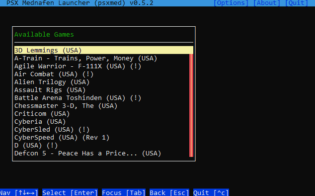
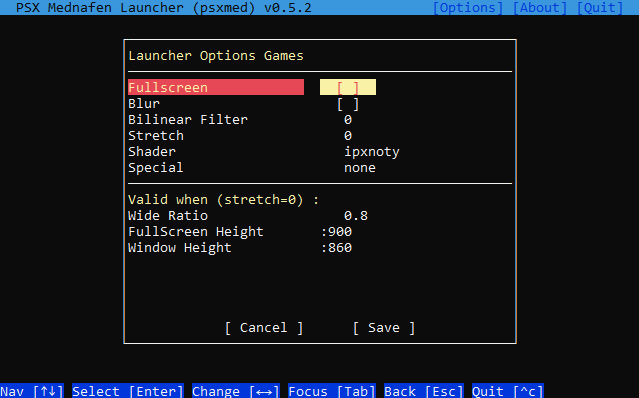

# PSXMED, PS1 Game Launcher for MEDNAFEN

**PSXMED**, **Version** : 0.5.2 (*2020-11*), **License** : MIT   
**Author** : John Dimi 

This is an **unorthodox** PS1 game launcher for **Mednafen** that comes with some practical features. It is unorthodox in a way that this is built using **NodeJS** and runs on a **terminal**. I guess this is completely obscure, who in the world uses a game launcher running on a terminal ? This whole project started just as a personal tool/helper to quickly launch PS1 games on Mednafen *(my favorite PS1 Emulator)*. 

## INSTALLING

- Windows Only! *(It can probably be ported to Linux easily, can't bother)*
- Make sure you have **NodeJS** installed with **NPM** *(NPM is the package manager of NodeJS, should install automatically when installing NodeJS)* :: https://nodejs.org
- Open a Command Prompt and run :  
  `npm i https://github.com/johndimi/psxmed -g`   
  This will install PSXMED globally and it can be run from anywhere
- You should have Mednafen *(version **1.24.3** or above)*, setup ready to go.
  - For Mednafen to be able to launch PS1 games you need to setup the PS1 BIOS files. *(google around)*
  - Open `mednafen.cfg` and set proper paths to : ``psx.bios_eu, psx.bios_jp, psx.bios_na` to point to the bios files
- Before running PSXMED, you need to configure it -> open a terminal and run: `psxmed cfg`  
  This will open the PSXMED configuration file with your default text editor.  **IF IT DOES NOT OPEN** for some reason, just call `psxmed` by itself, it will tell you that the settings are not set, along with the **path of the .ini file**, so open it in an editor manually.
- Once you have opened the PSXMED **.ini** file, you need to set:
  - `mednafen=` , The folder Mednafen is in.
  - `isos=`, Path of the CD images, It will **deep search** this folder for valid files.
  - These two are what are needed to run PSXMED. Everything else in there is **optional**.
- That's it. PSXMED is ready to run now by running `psxmed`  
  The **easiest way to run** it is to press `WIN+R` to open the windows RUN dialog, and run `psxmed` from there, it should create a new terminal window with PSXMED up and running.

## :tomato: USING PSXMED

PSXMED is a **TUI** *(terminal user interface)* and can only work with a keyboard.

**ARROW KEYS** : Navigate the Cursor Up/Down/Left/Right  
**TAB** : Switch focus between areas  
**ENTER** : Make a selection   
**PAGEUP/PAGEDOWN** : Scroll more elements in the main list  
**CTRL + C** : QUIT!  
**ESC / BACKSPACE** : Go Back   

While on the Main Game List : **Press a Letter** : Cycle through items starting with that letter.

## :lemon: OPTIONS

PSXMED offers \*some\* configuration options for Mednafen. 

When you are on the main Game List, press **TAB** to focus the top bar. There select **OPTIONS** and the options window opens. The first options *(before the divider)* are direct Mednafen parameters. Checkout https://mednafen.github.io/documentation/psx.html for more on what they do. (**TIP**: *Goat is a TV-like shader, and it looks nice*). Don't forget to **SAVE** when you change things. 

> It will write the `psx.cfg` file (in Mednafen's directory)  the main `mednafen.cfg` file remains untouched.

**Wide Ratio**: You can stretch the image on the x axis a bit. This can give you an intermediate between a 4:3 ratio and a 16:9 ratio. Only applicable when in windowed mode, or fullscreen with `stretch=0`  

**FullScreen Height** : The true fullscreen resolution Mednafen uses is the Desktop Resolution, but with this you can set the rendered area to be smaller/bigger. **This is only applicable** when `stretch=0` and it also applies the **wide ratio** set above. This is the only way I found to have an image that is slightly stretched on the X axis. Personally I don't like a 4:3 ratio and I find the 16:9 ratio to be too wide. So I use this in combination with a 0.5 Wide Ratio and most games look just fine.  

**Window Height** : Set a custom window height for when in windowed mode. Applies the **wide ratio** set above.

## :blue_book: OPTIONAL : Auto-Mounting and Launching games from Archives.

There is this tool for Windows : **Pismo File Mount** that can mount archives to virtual folders. So you can keep games in smaller sized archives, rather than raw CUE/BIN files. Also Mednafen supports loading .CUE files with encoded audio in them, so the combination of encoded audio tracks + archive reduces the file size of games by a lot.

- You can get Pismo File Mount from here: http://pismotec.com/download

- PSXMED can use Pismo File Mount *(it must be installed in your system)*, to automatically mount and launch games in archives ( supported : `.zip` `.pfo` `.cfs` )

- I recommend `CFS` archives, they use LZMA compression, which is better than ZIP compression

- I have made a TOOL to convert `.CUE` files to `.CFS` while also encoding the CDDA audio tracks to VORBIS, this is to maximize filesize savings. 

  - :fire: **GET IT FROM HERE** : https://github.com/johndimi/cuetocfs

- Example: `Rayman (1995).cfs` a game that has many audio tracks is down to just 75MB in `.cfs` format (from 500MB+) ready to be mounted and played. 

- **If you make your own archives**, make sure the mountable filename is the same as the `.cue` or `.m3u` that needs to be loaded inside the archive. *(This is mostly for the pushing/pulling saves feature)*
  
  > e.g. The file `"Game - Subtitle (PAL).zip"` must contain `"Game - Subtitle (PAL).cue"`  
  > or `"Game - Subtitle (PAL).m3u"` 

## :green_book: OPTIONAL : Alternative Save Folder

This is a niche feature. You can make Mednafen store savestates/memory card saves at a different folder, and then have it copy those files to the main Mednafen save location. Kind of like a buffer.  
If you choose to use this feature, open the `.ini` file and set the `savedir=` key to a folder *(it will be created)*. This will make Mednafen's default save position to this new folder.  

Then from the game selection you can :  

* **Push Saves** : Copy the game saves from Alternative Folder to Mednafen Folder
* **Pull Saves** : Copy the game saves from Mednafen Folder to the Alternative Folder
* **Delete Saves** : Some deletion options

**USE CASE** :  Use this to put the Save Folder on a **Ram Drive** and when you are done playing, **PUSH** the save files back to the Mednafen Folder for safe storage. Likewise, you can **PULL** saves so that they are ready to be used *(i.e. after a computer cold boot)*

**Motivation for this feature** : 

* Writing savestates all the time can be taxing to an SSD drive especially old ones. So by saving to ramdrive it saves a 2MB write everytime, and if you are like me, you could be using this every 5 seconds. So that is around 1GB of data per hour!
* Loading a savestate in Mednafen will also overwrite all `.MCR` files (memory card). This could accidentally lead to data loss. Also more re-writes on the SSD drive for no reason.
* It can be faster to write the savestate on a ramdrive (*possibly*)

## :warning: ​Important notice about OLD savegames 

This concerns you if you already have some savegames with Mednafen!  
PSXMED **alters** the naming template for savegames. It will read and write the `psx.cfg` file and make the changes upon application start. It will NOT DELETE any of your old saves, rather than change the filename convention of the expected filename, so your old saves will not load.

The default Mednafen save name convention for saves and states is like this : `GAME NAME.MD5.EXT`  
 *e.g.*  `Gex 3 - Deep Cover Gecko (USA).6b7f1763881380d97c7124f848c0712d.0.mcr`

But PSXMED needs the save files to be like this : `GAME NAME.EXT`   
*e.g.*  `Gex 3 - Deep Cover Gecko (USA).0.mcr`  *(Basically the same name without the MD5 portion)* 

**If you want to make the old saves to work, just rename them manually**, and delete the MD5 portion.  
Look into `mednafen/mcs` and `mednafen/sav` for saves. 

Sorry.:man_shrugging:

## :wrench: ​Building PSXMED from scratch

PSXMED is programmed in HAXE, targeting NodeJS. Some general HAXE knowledge is required if you want to get your hands dirty.

- **Haxe 4.1.3** https://haxe.org
- **djNode V0.6.0** https://github.com/johndimi/djNode -- *Get the tag zip file and install it with haxelib*
- **djTui V0.2.0** https://github.com/johndimi/djTui -- *Get the tag zip file and install it with haxelib*
- **hxnodejs** `haxelib install hxnodejs`

Clone the repo and **use NPM** to build: `npm run build`   This should build the binary `psxlaunch.js` in the bin folder

## :gem: About the Project

This app was created for personal use. But I decided to make a readme and upload to GitHub just because. **Why is this a thing?** I wanted a simple and quick way to launch Mednafen games, and automate a bunch of actions I was doing by hand. I used tools that I was already comfortable with. Also it was a nice programming practice and application of my [`djTui`](https://github.com/johndimi/djTui) library  

**Why NodeJS? and CLI?**  
I like NodeJS, it's simple, fast, and it does the job. Also it snowballed from something extremely simple just to launching games to having a UI and changing Mednafen settings etc.

Thanks for checking this out :smile_cat:,  
John.

